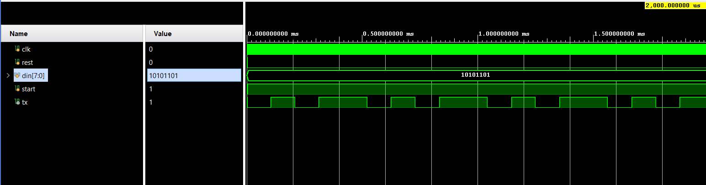
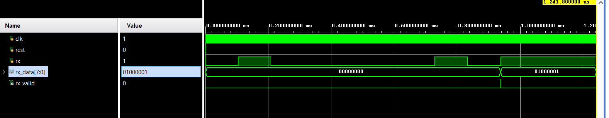

# UART Protocol – Verilog RTL

## Overview

This project implements a UART (Universal Asynchronous Receiver/Transmitter) protocol using Verilog HDL.

The design includes both:

- UART Transmitter (TX)
- UART Receiver (RX)
- TX testbench
- RX testbench
- Simulation waveform screenshots

The transmitter converts 8-bit parallel data into a serial UART data stream, while the receiver converts the serial UART data stream back into 8-bit parallel data.

---

## UART Configuration

| Parameter | Value |
|---|---|
| Data bits | 8 |
| Parity | None |
| Stop bits | 1 |
| Baud rate | 9600 |
| Clock frequency | 100 MHz |
| Data format | 8-N-1 |
| Data transmission | LSB first |

### UART Frame

Each transmitted byte follows this format:

```text
Idle  Start  Data Bits                         Stop
 1      0     D0 D1 D2 D3 D4 D5 D6 D7           1
## Simulation Results

### UART Transmitter (TX)

The TX simulation shows the UART serial output for the transmitted 8-bit data.



### UART Receiver (RX)

The RX simulation shows the received serial data being converted back into 8-bit parallel data.



## Files

| File | Description |
|---|---|
| `uart_tx.v` | UART transmitter RTL |
| `uart_rx.v` | UART receiver RTL |
| `uart_tx_tb.v` | UART transmitter testbench |
| `uart_rx_tb.v` | UART receiver testbench |
| `uart_tx_waveforms.png` | TX simulation waveform |
| `uart_rx_waveforms.png` | RX simulation waveform |
| `README.md` | Project documentation |
